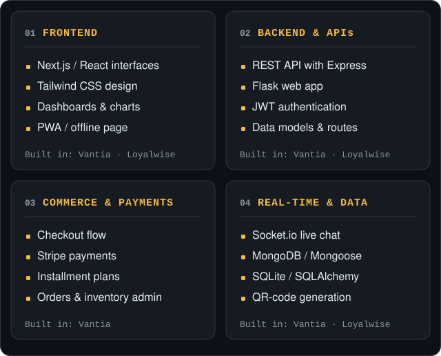
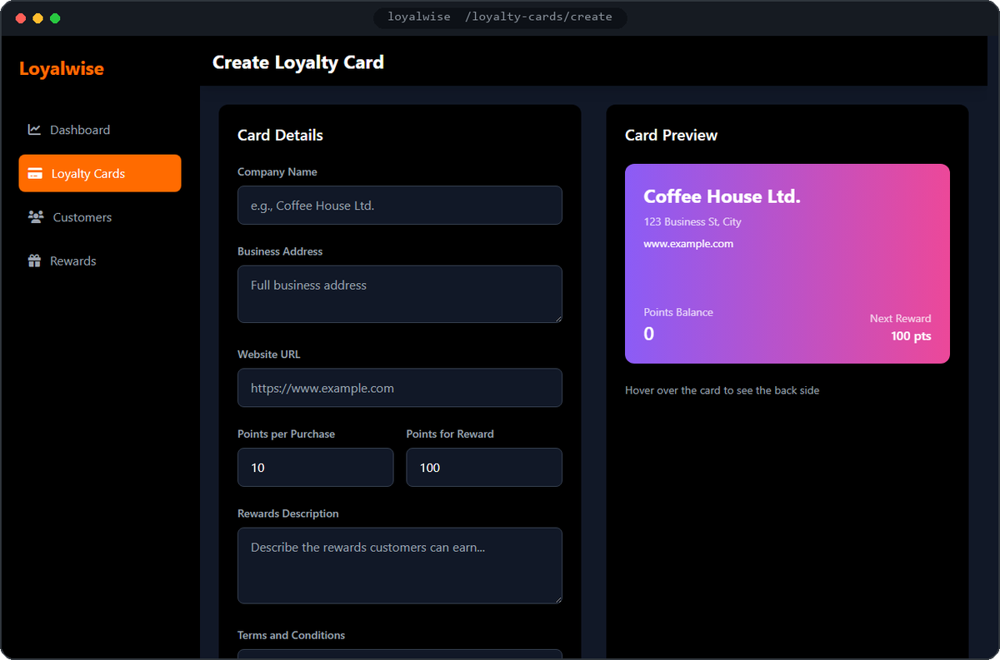
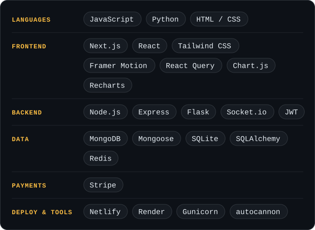
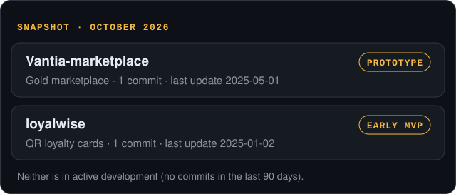

<!-- Profile README for github.com/Zefloxyhub. Assets live in /assets; design notes in /docs. -->

  <picture>
    <source media="(prefers-color-scheme: dark)" srcset="assets/hero-dark.svg">
    <source media="(prefers-color-scheme: light)" srcset="assets/hero-light.svg">
    
  </picture>

  <b>I build web apps that help businesses sell online and keep their customers coming back.</b> 
  Storefronts, checkout and payments, admin dashboards, and small-business tools.

  <a href="#featured-projects"><b>Projects</b></a> &nbsp;·&nbsp;
  <a href="#engineering-domains"><b>Domains</b></a> &nbsp;·&nbsp;
  <a href="#tech-stack"><b>Stack</b></a> &nbsp;·&nbsp;
  <a href="https://github.com/Zefloxyhub?tab=repositories"><b>All repositories</b></a>

 

## What I do

I build complete web applications: the part customers see and click, the server that handles orders and payments, and the database behind it.

- **Online stores and checkout.** Product catalogs, carts, card payments, and paying in installments.
- **Back-offices for owners.** Dashboards to manage products, orders, stock, customers and support chats.
- **Small-business tools.** Simple apps such as digital loyalty cards with QR codes.

## Engineering domains

  <picture>
    <source media="(prefers-color-scheme: dark)" srcset="assets/domains-dark.svg">
    <source media="(prefers-color-scheme: light)" srcset="assets/domains-light.svg">
    
  </picture>

Read as text

| Domain | What it covers | Built in |
|---|---|---|
| **Frontend** | Next.js / React interfaces, Tailwind CSS design, dashboards and charts, PWA / offline page | Vantia, Loyalwise |
| **Backend & APIs** | REST API with Express, Flask web app, JWT authentication, data models and routes | Vantia, Loyalwise |
| **Commerce & payments** | Checkout flow, Stripe payments, installment plans, orders and inventory admin | Vantia |
| **Real-time & data** | Socket.io live chat, MongoDB / Mongoose, SQLite / SQLAlchemy, QR-code generation | Vantia, Loyalwise |

## Featured projects

### Vantia: gold marketplace with installment payments

**What it is.** An online shop for gold bars, coins and jewelry where buyers can spread the cost over several monthly payments instead of paying all at once. It includes a customer account area and a back-office for the store owner.

**Why it matters.** It makes a high-value purchase more affordable for buyers, and it gives the owner one place to manage products, orders, inventory, analytics and live support chats.

**Built with.** Next.js · React · Tailwind CSS · Node.js / Express · MongoDB · Stripe · Socket.io · JWT

**Note.** This is a full-stack prototype. The gold-price and crypto-checkout features use demo data.

<a href="https://github.com/Zefloxyhub/Vantia-marketplace"><b>View repository →</b></a>

 

### Loyalwise: QR-code loyalty cards for small businesses

**What it is.** A shop fills in a short form (points per purchase, the reward, the terms) and gets a digital loyalty card with its own QR code and a shareable card page.

**Why it matters.** It replaces paper stamp cards, which customers lose and businesses can't track.

**Built with.** Python · Flask · SQLAlchemy / SQLite · qrcode / Pillow · Gunicorn

<a href="https://github.com/Zefloxyhub/loyalwise"><b>View repository →</b></a>

## Tech stack

  <picture>
    <source media="(prefers-color-scheme: dark)" srcset="assets/stack-dark.svg">
    <source media="(prefers-color-scheme: light)" srcset="assets/stack-light.svg">
    
  </picture>

Read as text

- **Languages:** JavaScript, Python, HTML / CSS
- **Frontend:** Next.js, React, Tailwind CSS, Framer Motion, React Query, Chart.js, Recharts
- **Backend:** Node.js, Express, Flask, Socket.io, JWT
- **Data:** MongoDB, Mongoose, SQLite, SQLAlchemy, Redis
- **Payments:** Stripe
- **Deploy & tools:** Netlify, Render, Gunicorn, autocannon

Everything listed is used in the code of the projects above.

## Project status

  <picture>
    <source media="(prefers-color-scheme: dark)" srcset="assets/status-dark.svg">
    <source media="(prefers-color-scheme: light)" srcset="assets/status-light.svg">
    
  </picture>

## How I build

- **Secrets stay out of the code.** Configuration comes from environment variables, and there is a written [API security guide](https://github.com/Zefloxyhub/Vantia-marketplace/blob/master/API_SECURITY.md).
- **Measure before scaling.** A [load-testing script](https://github.com/Zefloxyhub/Vantia-marketplace/blob/master/server/loadtest.js) and a performance monitor ship with the API.
- **Build the owner's tools, not just the storefront.** A full [admin area](https://github.com/Zefloxyhub/Vantia-marketplace/tree/master/client/src/pages/admin) for products, orders, inventory and support.

 

  <b>Want to see the code?</b> Start with <a href="https://github.com/Zefloxyhub/Vantia-marketplace">Vantia</a>, then <a href="https://github.com/Zefloxyhub/loyalwise">Loyalwise</a>. 
  <a href="https://github.com/Zefloxyhub">github.com/Zefloxyhub</a>

