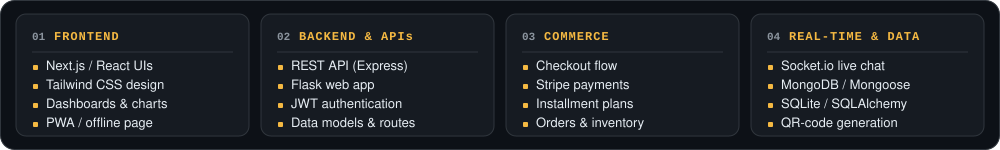
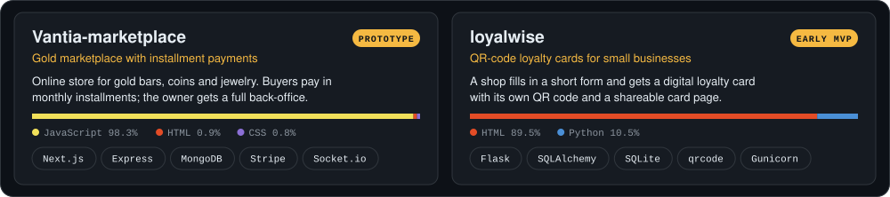
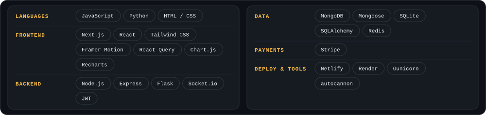

### Engineering domains

### Featured projects

  <a href="https://github.com/Zefloxyhub/divine"><b>divine →</b></a> &nbsp;·&nbsp;
  <a href="https://github.com/Zefloxyhub/loyalwise"><b>loyalwise →</b></a>

Project details

- **divine.** The website for Tradifier, a technology studio. The hero word breaks apart and reassembles, an Interface/System switch shows each section as the data it's built from, and a built-in terminal answers commands like `whoami` and `services`. Built with React, TypeScript, Vite and Framer Motion, and set up to deploy on Netlify.
- **loyalwise.** A shop fills in a short form (points per purchase, the reward, the terms) and gets a digital loyalty card with its own QR code and a shareable page. It replaces paper stamp cards. Early MVP.
- **Also on GitHub: [Vantia-marketplace](https://github.com/Zefloxyhub/Vantia-marketplace).** A full-stack prototype of a gold store with monthly installment payments, a customer area and a back-office for orders, inventory, analytics and support chat. The gold-price and crypto-checkout features use demo data.

### By the numbers

Snapshot of public GitHub data as of October 2026. Language share is the size of the source files in divine, Vantia-marketplace and loyalwise.

### Tech stack

How I build

- **Secrets stay out of the code.** Configuration comes from environment variables, and there's a written [API security guide](https://github.com/Zefloxyhub/Vantia-marketplace/blob/master/API_SECURITY.md).
- **Measure before scaling.** A [load-testing script](https://github.com/Zefloxyhub/Vantia-marketplace/blob/master/server/loadtest.js) and a performance monitor ship with the API.
- **Build the owner's tools, not just the storefront.** There's a full [admin area](https://github.com/Zefloxyhub/Vantia-marketplace/tree/master/client/src/pages/admin) for products, orders, inventory and support.

<a href="https://github.com/Zefloxyhub?tab=repositories">All repositories</a> · <a href="https://github.com/Zefloxyhub">github.com/Zefloxyhub</a>

